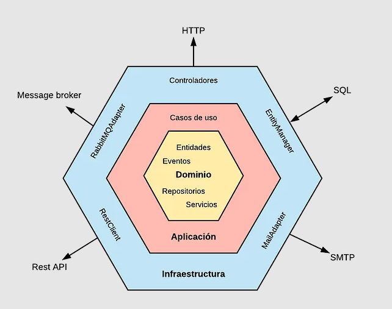
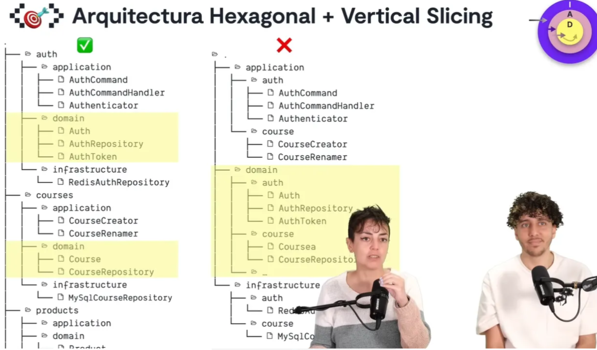
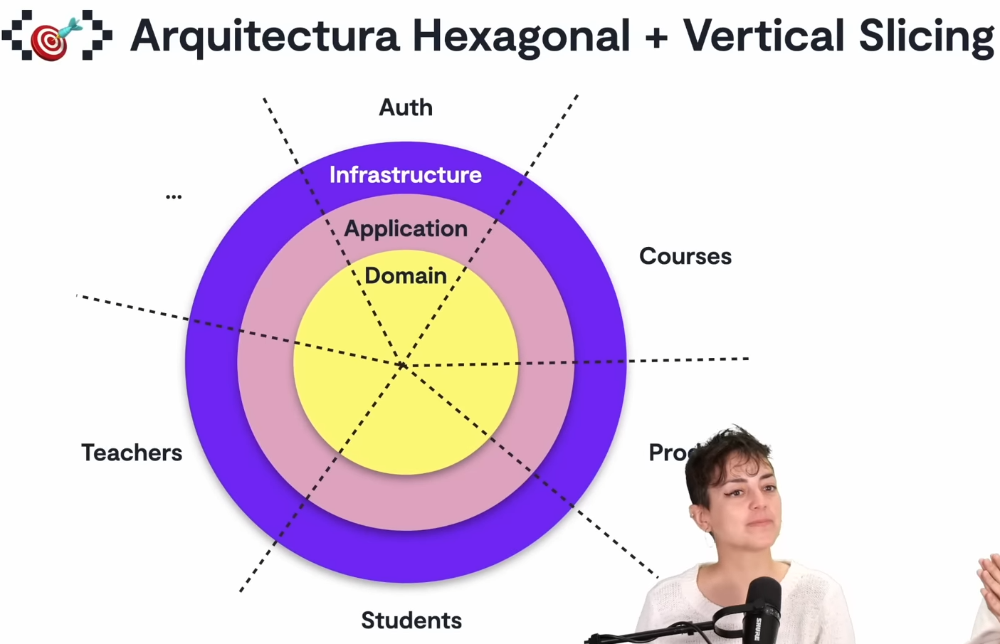

# [Arquitectura Hexagonal con Spring Boot — Parte 1 al 4](https://medium.com/@oliveraluis11/arquitectura-hexagonal-con-spring-boot-parte-1-57b797eca69c)

Tutorial tomado de la página web de **medium** del autor **Luis Antonio**.

---

## ¿Qué es la arquitectura hexagonal o patrón de puertos  y adaptadores?



> `La Arquitectura Hexagonal` propone que nuestro dominio sea el núcleo de las capas y que este no se acople a nada
> externo. En lugar de hacer uso explícito y **mediante el principio de inversión de dependencias nos acoplamos a
> contratos** `(interfaces o puertos)` y no a `implementaciones concretas`.

`Puertos`, **definición de una interfaz pública.** Permiten comunicar cada una de las capas de la aplicación. *Por
ejemplo, si queremos acceder a algún dato de la capa de aplicación, desde la capa de infraestructura, pues lo hacemos a
través de un puerto.* Y entonces, **¿qué son los puertos?, en esta arquitectura serían sencillamente interfaces.**

`Adaptadores`, **especialización de un puerto para un contexto concreto.** Puerta de comunicación con aplicaciones
externas. Es decir, es cualquier cosa que tenga que ver con algo externo a nuestra aplicación, *por ejemplo: una
conexión con base de datos, una petición a un servicio REST externo, etc.*
Esto se realiza desde la capa de infraestructura.

## Recursos

Utilizaremos [JsonPlaceholder API](https://jsonplaceholder.typicode.com/) como recurso que nos ayudará a dar un ejemplo
de cómo sería consumir una API utilizando arquitectura hexagonal.

## Dependencias

````xml
<!--Spring Boot 3.2.4-->
<!--Java 21-->
<!--spring-cloud.version 2023.0.1-->
<dependencies>
    <dependency>
        <groupId>org.springframework.boot</groupId>
        <artifactId>spring-boot-starter-web</artifactId>
    </dependency>
    <dependency>
        <groupId>org.springframework.cloud</groupId>
        <artifactId>spring-cloud-starter-openfeign</artifactId>
    </dependency>

    <dependency>
        <groupId>org.projectlombok</groupId>
        <artifactId>lombok</artifactId>
        <optional>true</optional>
    </dependency>
    <dependency>
        <groupId>org.springframework.boot</groupId>
        <artifactId>spring-boot-starter-test</artifactId>
        <scope>test</scope>
    </dependency>
</dependencies>
````

## Referencia para la estructura del proyecto

A la arquitectura hexagonal (Puertos y Adaptadores) que vamos a desarrollar la acompañaremos con
**vertical slicing (corte vertical)**.
Esta referencia lo podemos ver en el video siguiente **(click en la imagen)**:

[](https://www.youtube.com/watch?v=eNFAJbWCSww&feature=youtu.be)

`Vertical Slicing`, es una práctica de arquitectura de software que implica organizar la estructura de directorios de un
proyecto de manera que cada directorio represente una característica o funcionalidad completa del sistema, desde la
interfaz de usuario hasta la capa de datos. En lugar de organizar los archivos por tipo (por ejemplo, todos los modelos
juntos, todas las vistas juntas, etc.), el "vertical slicing" agrupa los archivos relacionados con una característica
específica en un solo lugar.

Esta práctica ayuda a mantener el código relacionado estrechamente junto y facilita la comprensión y modificación de una
característica particular del sistema. Además, el "vertical slicing" facilita la escalabilidad del proyecto, ya que cada
característica puede ser desarrollada, probada y desplegada de forma independiente, lo que permite un desarrollo más
ágil y flexible.

Por ejemplo, en un proyecto web de comercio electrónico, podrías tener un directorio para la autenticación de usuarios,
otro para la gestión de productos, otro para el proceso de pago, etc. Cada directorio contendría todos los archivos
relacionados con esa característica específica, como modelos de datos, controladores, vistas, rutas, etc. Esto hace que
sea más fácil para los desarrolladores trabajar en una parte específica del sistema sin tener que navegar a través de
múltiples directorios para encontrar los archivos relacionados.



---

# DOMAIN

---

En esta sección implementaremos la capa de `dominio`, donde vamos a definir nuestros modelos y los repositorios.

## Domain - Modelos

La siguiente clase define únicamente los atributos necesarios para nuestro `Post` para poder realizar operaciones
como `inserción`, `actualización` o `eliminación`:

````java

@Getter
@Builder
public class PostCommand {
    private Long userId;
    private String body;
    private String title;
}
````

En esta otra clase se definen todos los atributos, incluidos el `id` del `Post`, dado que se usará esta clase para
poder recuperar información del post. A diferencia de la clase anterior, esta clase representa la información que
vamos a recuperar, mientras que la clase anterior, representa la información que se va a persistir.

````java

@AllArgsConstructor
@Getter
public class PostQuery {
    private Long id;
    private Long userId;
    private String body;
    private String title;
}
````

## Domain - Repositorios

A continuación se muestra la definición de los `puertos (interfaces)`, que más adelante los usaremos para poder
realizar inyección de dependencias.

````java
public interface PostCommandRepository {
    Optional<PostQuery> createPost(PostCommand postCommand);

    Optional<PostQuery> updatePost(PostCommand postCommand);

    void deletePost(Long id);
}
````

````java
public interface PostQueryRepository {
    List<PostQuery> findAllPosts();

    Optional<PostQuery> findPostById(Long id);

    List<PostQuery> searchPostsByParams(Map<String, String> params);
}
````

Como vemos, nuestros puertos serían:

- `PostCommandRepository`
- `PostQueryRepository`

Las implementaciones de estas `interfaces (puertos)`, es decir, los `adaptadores (implementación de interfaz)` se
encontrarán en la capa de `infraestructura`.

## Domain - Servicios

A continuación se definen los puertos que serán implementados posteriormente en la capa de aplicación, es decir,
en la capa de aplicación crearemos los **adaptadores** de estos puertos:

````java
public interface PostCreateUseCasePort {
    PostQuery createPost(PostCommand postCommand);

    PostQuery updatePost(PostCommand postCommand, Long id);

    void deletePost(Long id);
}
````

````java
public interface PostFindUseCasePort {
    List<PostQuery> findAllPosts();

    List<PostQuery> findAllPostsByUserId(Long userId);

    PostQuery findPostById(Long id);
}
````

Recordemos que un **adaptador** es una clase concreta o implementación de nuestros **puertos (interfaces)**, en ese
sentido, observemos que en esta capa de **domain** hemos creado 2 tipos de puerto:

- Puertos de la carpeta `repository` de la capa `domain`, que su implementación se encuentra en la
  capa `infrastructure`.
- Puertos de la carpeta `service` de la capa `domain`, que su implementación se encuentra en la capa de `application`.

Así es, **los puertos de los casos de uso se encuentra dentro del package `service` de domain**, quiere decir que,
realizaremos la inyección de dependencias a través de estos puertos.

---

# APPLICATION

---

En esta capa `application` crearemos los casos de uso de nuestra aplicación que vendrían a ser implementaciones
(adapter) de las interfaces (ports) definidos en el `service` de `domain`:

````java

@RequiredArgsConstructor
@Service
public class PostCreateUseCase implements PostCreateUseCasePort {

    private final PostCommandRepository postCommandRepository;

    @Override
    public PostQuery createPost(PostCommand postCommand) {
        return this.postCommandRepository.createPost(postCommand)
                .orElseThrow(() -> new NoSuchElementException("No se retornó Post"));
    }

    @Override
    public PostQuery updatePost(PostCommand postCommand, Long id) {
        return this.postCommandRepository.updatePost(postCommand, id)
                .orElseThrow(() -> new NoSuchElementException("Ocurrió un error al actualizar"));
    }

    @Override
    public void deletePost(Long id) {
        this.postCommandRepository.deletePost(id);
    }
}
````

````java

@RequiredArgsConstructor
@Service
public class PostFindUseCase implements PostFindUseCasePort {

    private final PostQueryRepository postQueryRepository;

    @Override
    public List<PostQuery> findAllPosts() {
        return this.postQueryRepository.findAllPosts();
    }

    @Override
    public List<PostQuery> findAllPostsByUserId(Long userId) {
        return this.postQueryRepository.searchPostsByParams(Map.of("userId", String.valueOf(userId)));
    }

    @Override
    public PostQuery findPostById(Long id) {
        return this.postQueryRepository.findPostById(id)
                .orElseThrow(() -> new NoSuchElementException("No se encontró el post con id:" + id));
    }
}
````

Como nuestros casos de uso se encuentran en la capa de `application`, significa que sólo deben tener importaciones del
package `domain`, y **aquí es donde utilizaremos el patrón de Inyección de dependencias** por constructor, utilizando
la anotación `@RequiredArgsConstructor` de Lombok.

Por ejemplo, para acceder a nuestro adaptador `PostQueryRepositoryImpl` (que está en la capa infrastructure), utilizamos
la inyección de dependencias y accedemos a él a través de nuestro puerto `PostQueryRepository`. Deben recordar que:

- **La capa de `application` sólo debe conocer a domain**, y accede a infrastructure a través de la inyección de
  dependencias, y así estamos cumpliendo con nuestra Arquitectura Hexagonal como en la gráfica inicial.

---

# INFRASTRUCTURE

---

Si recordamos, en el paquete `domain` definimos los **puertos**: `PostCommandRepository` y `PostQueryRepository`. Ahora,
en esta capa de **infrastructure** añadiremos la implementación de dichos **puertos (interfaces)**, es decir
construiremos los `adaptadores (implementación de puertos)`.

Entonces, nuevamente **¿quiénes son los adaptadores?**, pues los adaptadores serían las clases concretas o
implementaciones de nuestras interfaces definidas en la capa de **Domain**.

## Adaptador - PostCommandRepositoryImpl

La implementación concreta (adaptador) de la interfaz (puerto) `PostCommandRepository` sería el siguiente:

````java

@RequiredArgsConstructor
@Repository
public class PostCommandRepositoryImpl implements PostCommandRepository {

    private final JsonPlaceholderAPIClient jsonPlaceholderAPIClient;

    @Override
    public Optional<PostQuery> createPost(PostCommand postCommand) {
        return Optional.ofNullable(this.jsonPlaceholderAPIClient.createPost(postCommand));
    }

    @Override
    public Optional<PostQuery> updatePost(PostCommand postCommand, Long postId) {
        return Optional.ofNullable(this.jsonPlaceholderAPIClient.updatePost(postCommand, postId));
    }

    @Override
    public void deletePost(Long id) {
        this.jsonPlaceholderAPIClient.deletePost(id);
    }
}
````

## Adaptador - PostQueryRepositoryImpl

La implementación concreta (adaptador) de la interfaz (puerto) `PostQueryRepository` sería el siguiente:

````java

@RequiredArgsConstructor
@Repository
public class PostQueryRepositoryImpl implements PostQueryRepository {

    private final JsonPlaceholderAPIClient placeholderAPIClient;

    @Override
    public List<PostQuery> findAllPosts() {
        return this.placeholderAPIClient.getAllPosts();
    }

    @Override
    public Optional<PostQuery> findPostById(Long id) {
        return Optional.ofNullable(this.placeholderAPIClient.findPostById(id));
    }

    @Override
    public List<PostQuery> searchPostsByParams(Map<String, String> params) {
        return this.placeholderAPIClient.searchPostByParam(params);
    }
}
````

## Consumiendo JsonPlaceholderAPI

Ambas implementaciones están usando la interfaz `JsonPlaceholderAPIClient` quien es usado como un `cliente HTTP`, dado
que estamos usando anotaciones de `@FeignClient`. En otras palabras, vamos a consumir un api externa y para eso
utilizamos de entre las múltiples opciones, la opción de usar `feign client`.

`Feign Client` es una herramienta en Spring Boot que permite a los desarrolladores definir interfaces Java para
comunicarse con otros servicios HTTP de manera declarativa y simplificada.

En lugar de escribir manualmente el código para realizar solicitudes HTTP utilizando bibliotecas
como `RestTemplate`, `WebClient` o `RestClient`, `Feign Client` **permite definir interfaces con anotaciones que
describen las solicitudes que se realizarán, incluidos los métodos, las URL y los parámetros de solicitud.** Luego,
Spring Boot se encarga de generar automáticamente la implementación de estas interfaces, lo que simplifica
significativamente el código y reduce la carga de trabajo del desarrollador.

````java

@FeignClient(name = "jsonplaceholder", url = "https://jsonplaceholder.typicode.com", path = "/posts")
public interface JsonPlaceholderAPIClient {
    @GetMapping
    List<PostQuery> getAllPosts();

    @GetMapping
    List<PostQuery> searchPostByParam(@RequestParam Map<String, String> params);

    @GetMapping(path = "/{id}")
    PostQuery findPostById(@PathVariable Long id);

    @PostMapping
    PostQuery createPost(@RequestBody PostCommand postCommand);

    @PutMapping(path = "/{id}")
    PostQuery updatePost(@RequestBody PostCommand postCommand, @PathVariable Long id);

    @DeleteMapping(path = "/{id}")
    void deletePost(@PathVariable Long id);
}
````

Para que nuestra interfaz anotada con `@FeignClient` funcione, necesitamos agregar en la clase principal de la
aplicación la anotación `@EnableFeignClients`:

````java

@EnableFeignClients
@SpringBootApplication
public class HexagonalApplication {
    /* code */
}
````

También tenemos nuestra carpeta `database` en este caso yo no lo estoy utilizando para el ejemplo, pero prácticamente
allí iría nuestra interface que en el MVC llamamos el `@Repository`, por ejemplo.

````java
public interface PostMySqlRepository extends JpaRepository<PostEntity, Long> {
}
````

## Controladores

Ahora nos falta poder usar nuestros casos de uso en nuestros controladores, para eso crearemos la clase `PostController`
dentro del paquete **infrastructure**.

Recordar que como los casos de uso son implementaciones de los puertos definidos en el paquete `service` de `domain`,
es que en los controladores usaremos dichos puertos, para que puedan ser inyectados en tiempo de ejecución las clases
concretas o implementadas de dichos puertos.

````java

@RequiredArgsConstructor
@RestController
@RequestMapping(path = "/api/v1/posts")
public class PostController {

    private final PostFindUseCasePort postFindUseCasePort;
    private final PostCreateUseCasePort postCreateUseCasePort;

    @GetMapping
    public ResponseEntity<List<PostQuery>> findAllPosts() {
        return ResponseEntity.ok(this.postFindUseCasePort.findAllPosts());
    }

    @GetMapping(path = "/{id}")
    public ResponseEntity<PostQuery> findPostById(@PathVariable Long id) {
        return ResponseEntity.ok(this.postFindUseCasePort.findPostById(id));
    }

    @GetMapping(path = "/user/{userId}")
    public ResponseEntity<List<PostQuery>> findAllPostsByUserId(@PathVariable Long userId) {
        return ResponseEntity.ok(this.postFindUseCasePort.findAllPostsByUserId(userId));
    }

    @PostMapping
    public ResponseEntity<PostQuery> savePosts(@RequestBody PostCommand postCommand) {
        PostQuery postDB = this.postCreateUseCasePort.createPost(postCommand);
        URI uri = URI.create("/api/v1/posts/" + postDB.getId());
        return ResponseEntity.created(uri).body(postDB);
    }

    @PutMapping(path = "/{id}")
    public ResponseEntity<PostQuery> updatePost(@RequestBody PostCommand postCommand, @PathVariable Long id) {
        return ResponseEntity.ok(this.postCreateUseCasePort.updatePost(postCommand, id));
    }

    @DeleteMapping(path = "/{id}")
    public ResponseEntity<Void> deletePost(@PathVariable Long id) {
        this.postCreateUseCasePort.deletePost(id);
        return ResponseEntity.noContent().build();
    }
}
````

## Ejecutando aplicación

````bash
$ curl -v http://localhost:8080/api/v1/posts | jq

< HTTP/1.1 200
<
[
  {
    "id": 1,
    "userId": 1,
    "body": "quia et suscipit\nsuscipit recusandae consequuntur expedita et cum\nreprehenderit molestiae ut ut quas totam\nnostrum rerum est autem sunt rem eveniet architecto",
    "title": "sunt aut facere repellat provident occaecati excepturi optio reprehenderit"
  },
  {...},
  {
    "id": 99,
    "userId": 10,
    "body": "quo deleniti praesentium dicta non quod\naut est molestias\nmolestias et officia quis nihil\nitaque dolorem quia",
    "title": "temporibus sit alias delectus eligendi possimus magni"
  },
  {
    "id": 100,
    "userId": 10,
    "body": "cupiditate quo est a modi nesciunt soluta\nipsa voluptas error itaque dicta in\nautem qui minus magnam et distinctio eum\naccusamus ratione error aut",
    "title": "at nam consequatur ea labore ea harum"
  }
]
````

````bash
$ curl -v http://localhost:8080/api/v1/posts/3 | jq

< HTTP/1.1 200
<
{
  "id": 3,
  "userId": 1,
  "body": "et iusto sed quo iure\nvoluptatem occaecati omnis eligendi aut ad\nvoluptatem doloribus vel accusantium quis pariatur\nmolestiae porro eius odio et labore et velit aut",
  "title": "ea molestias quasi exercitationem repellat qui ipsa sit aut"
}
````

````bash
$ curl -v http://localhost:8080/api/v1/posts/user/3 | jq

< HTTP/1.1 200
<
[
  {
    "id": 21,
    "userId": 3,
    "body": "repellat aliquid praesentium dolorem quo\nsed totam minus non itaque\nnihil labore molestiae sunt dolor eveniet hic recusandae veniam\ntempora et tenetur expedita sunt",
    "title": "asperiores ea ipsam voluptatibus modi minima quia sint"
  },
  {...},
  {
    "id": 29,
    "userId": 3,
    "body": "odit magnam ut saepe sed non qui\ntempora atque nihil\naccusamus illum doloribus illo dolor\neligendi repudiandae odit magni similique sed cum maiores",
    "title": "iusto eius quod necessitatibus culpa ea"
  },
  {
    "id": 30,
    "userId": 3,
    "body": "alias dolor cumque\nimpedit blanditiis non eveniet odio maxime\nblanditiis amet eius quis tempora quia autem rem\na provident perspiciatis quia",
    "title": "a quo magni similique perferendis"
  }
]
````

````bash
$ curl -v -X POST -H "Content-Type: application/json" -d "{\"userId\": 1, \"body\": \"mi nuevo post\", \"title\": \"post inedito\"}" http://localhost:8080/api/v1/posts | jq

< HTTP/1.1 201
<
{
  "id": 101,
  "userId": 1,
  "body": "mi nuevo post",
  "title": "post inedito"
}
````

````bash
$ curl -v -X PUT -H "Content-Type: application/json" -d "{\"userId\": 1, \"body\": \"mi nuevo post - UPDATE\", \"title\": \"post inedito - UPDATE\"}" http://localhost:8080/api/v1/posts/2 | jq

< HTTP/1.1 200
<
{
  "id": 2,
  "userId": 1,
  "body": "mi nuevo post - UPDATE",
  "title": "post inedito - UPDATE"
}
````

````bash
$ curl -v -X DELETE http://localhost:8080/api/v1/posts/2 | jq

< HTTP/1.1 204
````